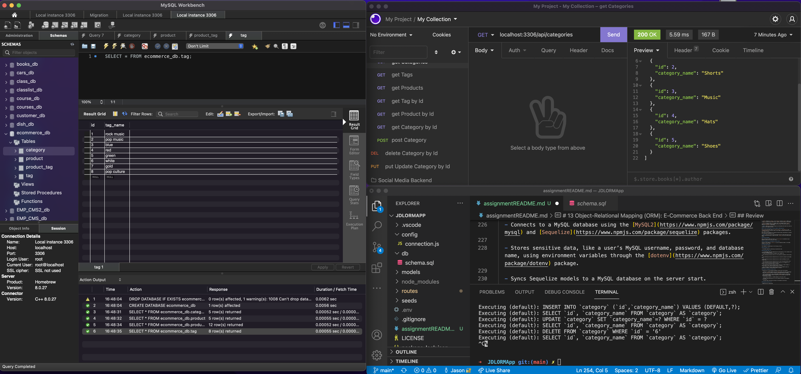

# ORM ECommerce Back-end

[]

## Table of Contents

- [Description](#description)
- [Technologies Used](#technologies-used)
- [Demonstration](#demonstration)
- [Setup](#setup)
- [Usage](#usage)
- [Project Updates](#project-updates)
- [Project Status](#project-status)
- [Have any Questions](#questions)
- [License](#license)

## Project Status

#### The status of Project ORM ECommerce Back-end is currently:

- ##### _complete_
- ###### The reason: Acceptance criteria met

## Demonstration

[Google Drive .mov file](https://drive.google.com/file/d/1DMnbiOO06LtHhcSrylbslMjIHtP4RiU8/view?usp=sharing)

Live demo .

## Description

- This Project demonstrates my ability to create a database and perform CRUD operations.

## Technologies Used

- Node, MySQL, Insomnia, Javascript, Express

## Setup

To use this application, you must have the following technologies installed:

- A Code Editor, MySQL, Insomnia

## Usage

- follow the scripts in the package.json

## Questions

This application was created by: 

- I encourage you to [send me an email](mailto:LutzJason92@gmail.com)
  if you have any questions or comments.

## Contributors

Thank you to these GitHub users for thier contributions:

- https://github.com/LutzJason92

## License

- This appplication is currently using a mit license.
